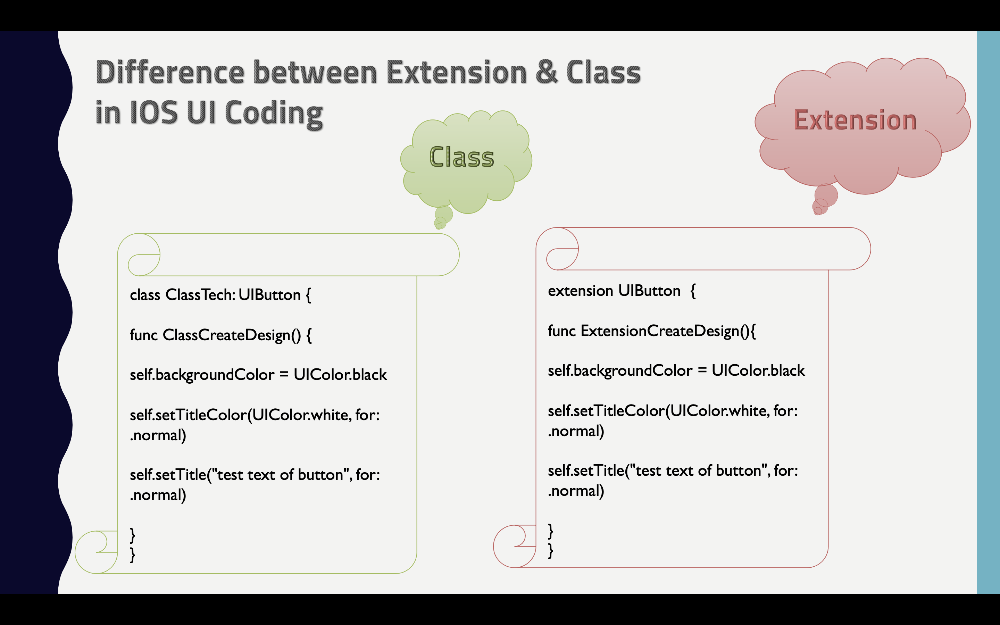

# Technicalisto

## IOS Swift : Different between Class & Extension in IOS UI in Coding ( Simple )

Note : 
       for easy understand firstly read this file once
       / follow steps in new project from this [ReadMe](https://github.com/AyaBaghdadi/class_vs_extension_ui) file or from this [Video](https://youtu.be/1hZI1KZkM7U)
       


Class

classes are general purpose , flexible constructs that become the building blocks , define properties and methods to add functionality to classes

```

import UIKit

class ClassTech: UIButton {
    
func ClassCreateDesign() {
        
self.backgroundColor = UIColor.black
        
self.setTitleColor(UIColor.white, for: .normal)
        
self.setTitle("test text of button", for: .normal)
        
        
}
}
```

Extension

By extensions can add new functionality to existing types

```

import UIKit

extension UIButton  {

func ExtensionCreateDesign(){
        
self.backgroundColor = UIColor.black
        
self.setTitleColor(UIColor.white, for: .normal)
        
self.setTitle("test text of button", for: .normal)
        
self.addTarget(self, action: #selector(buttonAction(sender:)), for: .touchUpInside)

}
    
/// This method in extension UIButton
@objc func buttonAction(sender: UIButton) {
        
print("Button pushed from Extention")
        
}
    
}
```

Extension can make in Class

```

extension ClassTech {
    
func ExtensionFromClassCreateDesign(){
        
self.backgroundColor = UIColor.black
        
self.setTitleColor(UIColor.white, for: .normal)
        
self.setTitle("test text of button", for: .normal)
                
}
}
```

Extension can write more than one of the same type

```

extension ClassTech  {
    
    func TestDublicate(){
        
        print("Another Dublicate")
        
    }
}
```

### Thanks

This is inspired by Aya Baghdadi”
and copyright for [@Technicalisto](https://www.youtube.com/channel/UC7554uvArdSxL4tlws7Wf8Q)
